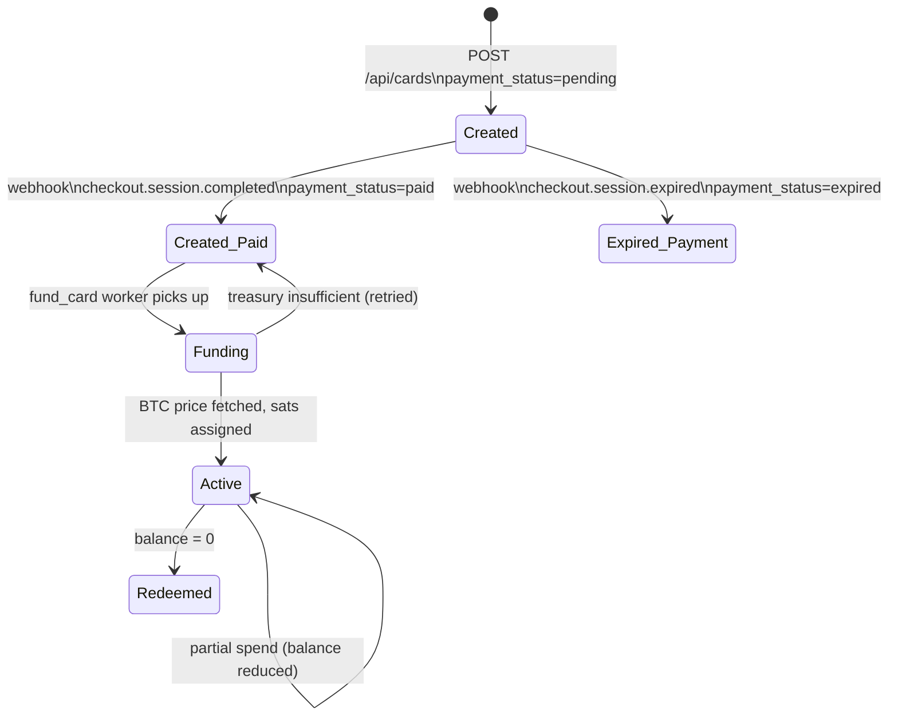
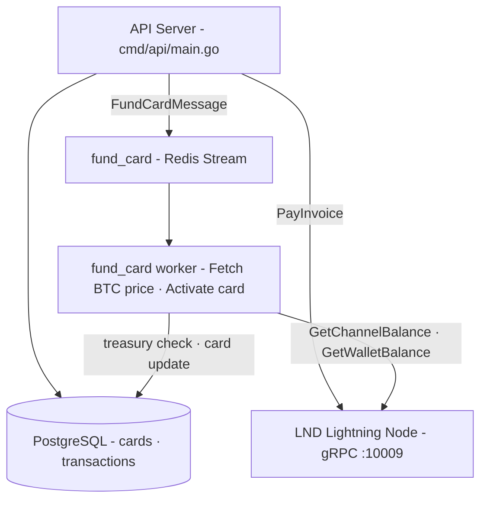
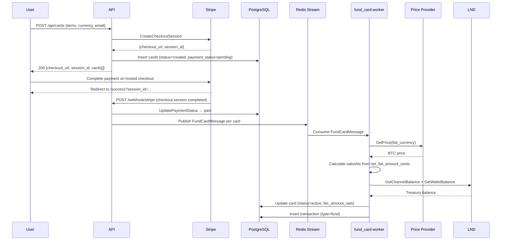
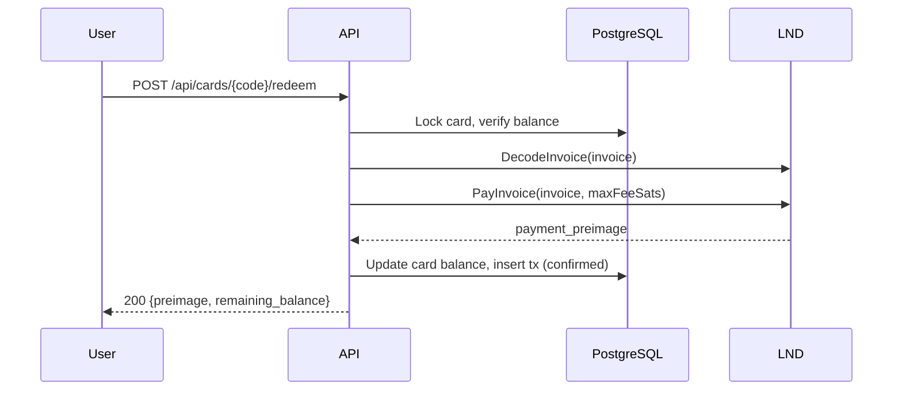

# BTC Gift Card — Bitcoin Gift Card Platform

A custodial Bitcoin gift card service built in Go. Users purchase gift cards with fiat, and the platform holds BTC in a shared treasury (LND Lightning node). Cards are balance claims — BTC only moves when a user redeems via Lightning Network.

---

## How It Works

### For Users

1. **Purchase** — Buy a gift card with fiat (USD/EUR). Receive a unique card code.
2. **Fund** — A background worker fetches the current BTC price and assigns the equivalent satoshi balance to the card.
3. **Redeem** — Provide your card code + a Lightning invoice or Bitcoin address. BTC is sent from the platform treasury directly to you.
4. **Partial Spends** — Cards support multiple redemptions. The balance decreases with each spend until it reaches zero.

### Card Lifecycle


```mermaid
stateDiagram-v2
    [*] --> Created : POST /api/cards\npayment_status=pending
    Created --> Created_Paid : webhook\ncheckout.session.completed\npayment_status=paid
    Created --> Expired_Payment : webhook\ncheckout.session.expired\npayment_status=expired
    Created_Paid --> Funding : fund_card worker picks up
    Funding --> Active : BTC price fetched, sats assigned
    Active --> Active : partial spend (balance reduced)
    Active --> Redeemed : balance = 0
    Funding --> Created_Paid : treasury insufficient (retried)
```

| Status   | Meaning                                                          |
|----------|------------------------------------------------------------------|
| Created  | Card saved; payment pending or paid, awaiting funding worker     |
| Funding  | Worker acquired treasury lock, calculating sats                  |
| Active   | Card has a BTC balance, ready to redeem                          |
| Redeemed | Balance is zero, card is fully spent                             |
| Expired  | Funding timed out (rare edge case)                               |

**Payment status** (separate from card status):

| Payment Status | Meaning |
|---|---|
| pending | Checkout session created, awaiting payment |
| paid | Stripe confirmed payment; funding worker will activate card |
| expired | Checkout session timed out (24h); card never funded |
| failed | Payment failed |

---

## Architecture

### Custodial Treasury Model

The platform does **not** create a wallet per card. Instead:

- All BTC is held in a single LND Lightning node (channel balance + on-chain wallet used for treasury deposits only).
- Cards are database entries with a `btc_amount_sats` field representing their balance claim on the treasury.
- BTC only leaves the treasury when a user redeems a card.

```
Treasury Balance = LND On-Chain Wallet + LND Channel Balance
Available Balance = Treasury Balance − SUM(unredeemed card balances)
```

### System Components


```mermaid
graph TD
    API["API Server - cmd/api/main.go"] -->|FundCardMessage| Q1["fund_card - Redis Stream"]
    API --> DB[("PostgreSQL - cards · transactions")]
    API -->|"PayInvoice"| LND["LND Lightning Node - gRPC :10009"]

    Q1 --> W1["fund_card worker - Fetch BTC price · Activate card"]

    W1 -->|"treasury check · card update"| DB
    W1 -->|"GetChannelBalance · GetWalletBalance"| LND
```

**API Endpoints:**

| Endpoint | Purpose |
|---|---|
| `POST /api/cards` | Create bulk card order → returns Stripe `checkout_url` |
| `GET /api/cards/{code}` | Get card details |
| `GET /api/cards/{code}/balance` | Get remaining sats balance |
| `GET /api/cards/{code}/validate` | Check validity and status |
| `POST /api/cards/{code}/redeem` | Redeem card via Lightning Network |
| `GET /api/checkout/sessions/{id}` | Poll payment + activation status |
| `POST /api/webhook/stripe` | Stripe webhook receiver |
| `GET /api/treasury/balance` | Available treasury sats |
| `GET /health` | Health check |

**LND Operations:** PayInvoice, DecodeInvoice, GetWalletBalance, GetChannelBalance, NewAddress, GetInfo

### Purchase Flow


```mermaid
sequenceDiagram
    participant User
    participant API
    participant Stripe
    participant DB as PostgreSQL
    participant Queue as Redis Stream
    participant Worker as fund_card worker
    participant Exchange as Price Provider
    participant LND

    User->>API: POST /api/cards {items, currency, email}
    API->>Stripe: CreateCheckoutSession
    Stripe-->>API: {checkout_url, session_id}
    API->>DB: Insert cards (status=created, payment_status=pending)
    API-->>User: 200 {checkout_url, session_id, cards[]}

    User->>Stripe: Complete payment on hosted checkout
    Stripe-->>User: Redirect to /success?session_id=...
    Stripe->>API: POST /webhook/stripe (checkout.session.completed)
    API->>DB: UpdatePaymentStatus → paid
    API->>Queue: Publish FundCardMessage per card

    Queue->>Worker: Consume FundCardMessage
    Worker->>Exchange: GetPrice(fiat_currency)
    Exchange-->>Worker: BTC price
    Worker->>Worker: Calculate satoshis from net_fiat_amount_cents
    Worker->>LND: GetChannelBalance + GetWalletBalance
    LND-->>Worker: Treasury balance
    Worker->>DB: Update card (status=active, btc_amount_sats)
    Worker->>DB: Insert transaction (type=fund)
```

### Redemption Flow


```mermaid
sequenceDiagram
    participant User
    participant API
    participant DB as PostgreSQL
    participant LND

    User->>API: POST /api/cards/{code}/redeem
    API->>DB: Lock card, verify balance
    API->>LND: DecodeInvoice(invoice)
    API->>LND: PayInvoice(invoice, maxFeeSats)
    LND-->>API: payment_preimage
    API->>DB: Update card balance, insert tx (confirmed)
    API-->>User: 200 {preimage, remaining_balance}
```

### Redemption

All redemptions use the Lightning Network. The user provides a BOLT11 invoice and the platform pays it instantly via the LND node. Payments confirm in seconds with near-zero fees.

---

## Project Structure

```
btc-giftcard/
├── cmd/
│   ├── api/                    # HTTP API server
│   │   ├── main.go             #   Entrypoint: init infra, start server
│   │   ├── routes.go           #   Router setup + middleware chain
│   │   ├── handlers.go         #   HTTP handlers (card, treasury, health)
│   │   └── middleware.go       #   Logging, recovery, CORS, error helpers
│   ├── worker/
│   │   └── fund_card/          # Fund card worker
│   │       └── main.go         #   Fetch price → calculate sats → delegate to Service.FundCard
│   └── migrate/                # Database migration runner
├── internal/
│   ├── card/                   # Core business logic
│   │   ├── service.go          #   Card lifecycle, Stripe checkout, webhook handler, redemption
│   │   └── service_test.go     #   Integration tests
│   ├── fees/                   # Fee calculation engine
│   │   ├── calculator.go       #   Service, Stripe, SEPA fee breakdown
│   │   └── calculator_test.go
│   ├── payment/                # Payment provider abstraction
│   │   ├── provider.go         #   Provider interface
│   │   ├── models.go           #   LineItem, CheckoutSession, Event types
│   │   ├── stripe.go           #   Stripe client (CreateCheckoutSession, ConstructEvent)
│   │   └── stripe_test.go
│   ├── lnd/                    # LND gRPC client wrapper
│   │   ├── client.go           #   Connection, TLS, macaroon auth, Network enum
│   │   ├── lightning.go        #   PayInvoice, DecodeInvoice
│   │   ├── onchain.go          #   NewAddress, GetWalletBalance
│   │   ├── treasury.go         #   GetChannelBalance, GetInfo
│   │   └── *_test.go           #   Unit + integration tests
│   ├── database/               # PostgreSQL models + repositories
│   │   ├── model.go            #   Card, Transaction, FiatCurrency/PaymentMethod enums
│   │   ├── card_repository.go  #   CRUD for cards
│   │   └── transaction_repository.go # CRUD for transactions
│   ├── queue/                  # Message definitions
│   │   └── messages.go         #   FundCardMessage {card_id, net_fiat_amount_cents, fiat_currency}
│   ├── exchange/               # BTC/fiat price providers
│   │   └── provider.go         #   Coinbase, CoinGecko, Bitstamp
│   ├── crypto/                 # AES-256-GCM encryption utilities
│   └── merchant/               # (placeholder) Merchant payment features
├── pkg/
│   ├── cache/                  # Redis client wrapper (Get/Set/SetNX/Delete/Incr)
│   ├── queue/                  # Redis Streams consumer/producer
│   └── logger/                 # Zap structured logging
├── config/                     # Config structs + TOML loader
├── config.toml                 # App configuration
├── docker-compose.yml          # Primary stack: Postgres, Redis, LND (testnet neutrino), lnd-creds-exporter
├── docker-compose.regtest.yml  # Regtest override: bitcoind + lnd_customer, isolated volumes
├── scripts/
│   └── regtest-setup.sh        # One-command regtest bootstrap (mine blocks, open channel)
├── migrations/                 # SQL migration files
└── lnd-creds/                  # TLS cert + macaroon (git-ignored, populated by lnd-creds-exporter)
```

---

## Database Schema

### Cards

| Column                   | Type      | Description                                            |
|--------------------------|-----------|--------------------------------------------------------|
| id                       | UUID PK   | Card identifier                                        |
| user_id                  | UUID NULL | Optional link to a user account                        |
| purchase_email           | TEXT      | Buyer's email (for delivery + verification)            |
| owner_email              | TEXT      | Current owner's email                                  |
| code                     | TEXT UQ   | Redemption code (e.g. GIFT-XXXX-YYYY-ZZZZ)            |
| btc_amount_sats          | BIGINT    | Remaining balance in satoshis                          |
| fiat_amount_cents        | BIGINT    | Gross face value (what customer pays), in cents        |
| fiat_currency            | VARCHAR(3)| Currency code (EUR)                                    |
| status                   | ENUM      | created / funding / active / redeemed / expired        |
| payment_method           | TEXT      | card \| bank_transfer                                  |
| payment_reference        | TEXT UQ   | Stripe session ID or SEPA reference                    |
| payment_status           | ENUM      | pending / paid / failed / expired                      |
| payment_expires_at       | TIMESTAMPTZ | 24h payment window; NULL after payment confirmed     |
| stripe_checkout_url      | TEXT NULL | Stripe hosted checkout URL (card payments only)        |
| sepa_reference           | TEXT NULL | Random reference code for SEPA bank transfers          |
| service_fee_cents        | BIGINT    | Platform service margin in cents                       |
| processor_fee_cents      | BIGINT    | Stripe % fee in cents (0 for bank transfer)            |
| processor_fee_flat_cents | BIGINT    | Stripe flat fee in cents (0 for bank transfer)         |
| crypto_spread_cents      | BIGINT    | OTC spread estimate in cents                           |
| sepa_fee_cents           | BIGINT    | SEPA processing fee (currently 0 via Qonto)            |
| total_fee_cents          | BIGINT    | Sum of all fee columns                                 |
| stripe_fee_actual_cents  | BIGINT    | Actual Stripe fee populated async after T+1 settlement |
| btc_price_eur_cents      | BIGINT    | BTC/EUR price locked at card creation                  |
| created_at               | TIMESTAMPTZ | Card creation time                                   |
| funded_at                | TIMESTAMPTZ | When BTC balance was assigned                        |
| redeemed_at              | TIMESTAMPTZ | When balance reached zero                            |

### Transactions

| Column             | Type      | Description                                  |
|--------------------|-----------|----------------------------------------------|
| id                 | UUID PK   | Transaction identifier                       |
| card_id            | UUID FK   | Associated card                              |
| type               | TEXT      | fund / redeem / payment                      |
| redemption_method  | TEXT NULL | lightning                                     |
| tx_hash            | TEXT NULL | On-chain transaction hash                    |
| payment_hash       | TEXT NULL | Lightning payment hash                       |
| payment_preimage   | TEXT NULL | Lightning proof of payment                   |
| lightning_invoice   | TEXT NULL | BOLT11 invoice string                        |
| from_address       | TEXT NULL | Source address                               |
| to_address         | TEXT NULL | Destination address                          |
| btc_amount_sats    | BIGINT    | Amount in satoshis                           |
| status             | TEXT      | pending / confirmed / failed                 |
| confirmations      | INT       | On-chain confirmation count                  |
| created_at         | TIMESTAMP | Transaction creation time                    |
| broadcast_at       | TIMESTAMP | When transaction was broadcast               |
| confirmed_at       | TIMESTAMP | When transaction was confirmed               |

---

## Redis Usage

| Key Pattern              | Purpose                              | TTL  |
|--------------------------|--------------------------------------|------|
| `treasury:available_sats`| Cached treasury balance              | 10s  |
| `treasury:lock`          | Distributed lock for treasury writes | 5s   |
| `card:lock:{code}`       | Per-card lock (concurrent redemption)| 10s  |
| `fund_card` stream       | Queue for card funding messages      | —    |

---

## Configuration

All settings are in `config.toml` and can be overridden with environment variables:

```toml
[database]
host = "localhost"
port = "5432"
user = "postgres"
password = "postgres"
db = "btcgifter"

[redis]
host = "localhost"
port = "6379"

[lnd]
grpc_host = "localhost"
port = "10009"
tls_cert_path = "./lnd-creds/tls.cert"
macaroon_path = "./lnd-creds/admin.macaroon"
network = "testnet"
payment_timeout_seconds = 30
max_payment_fee_sats = 100
```

---

## Getting Started

### Prerequisites

- Go 1.24+
- Docker & Docker Compose v2
- [Stripe CLI](https://docs.stripe.com/stripe-cli/install) (for local webhook testing)

### 1. Start the full stack

```bash
docker compose up -d
```

This starts PostgreSQL, Redis, LND (testnet neutrino), and `lnd-creds-exporter`.
`lnd-creds-exporter` is a one-shot container that waits for LND to become healthy,
copies `tls.cert` and `admin.macaroon` from the LND volume to `./lnd-creds/`, then
exits. The API server and workers wait for it to complete before starting — no manual
credential copy is needed.

LND takes 2–10 minutes to sync to testnet on first boot. Check progress:

```bash
curl http://localhost:3202/api/node/info | jq .synced_to_chain
```

### 2. Run Tests

```bash
go test ./...                     # All tests
go test ./internal/lnd/... -v     # LND unit tests
go test ./internal/card/... -v    # Card service tests
go test -tags=integration ./...   # integration tests
```

---

## Local Stripe Payment Testing (No Frontend Required)

This section explains how to exercise the full payment flow — card creation,
Stripe checkout, webhook processing, and card activation — using only `curl`
and the Stripe CLI.

### Why the Stripe CLI is required for local testing

Stripe's servers cannot reach `localhost`. The `stripe listen` command acts as
an authenticated tunnel: Stripe sends webhook events to the CLI process, which
forwards them as HTTP `POST` requests to your local server.

```
Stripe servers  →  stripe listen  →  localhost:3202/api/webhook/stripe
```

Without `stripe listen` running, no webhook events reach your server and cards
remain in `payment_status = pending` indefinitely.

### Step 1 — Configure Stripe credentials

In `.env` (or `config.toml`), set your Stripe **test** keys:

```bash
GIFTER_STRIPE_SECRET_KEY=sk_test_...      # from dashboard.stripe.com/apikeys
GIFTER_STRIPE_WEBHOOK_SECRET=            # leave empty for now — filled in Step 3
GIFTER_FRONTEND_BASE_URL=http://localhost:5173
```

### Step 2 — Start the stack

```bash
docker compose up -d
```

### Step 3 — Start the Stripe CLI listener

```bash
stripe login          # one-time OAuth — opens browser
stripe listen \
  --events checkout.session.completed,checkout.session.expired \
  --forward-to localhost:3202/api/webhook/stripe
```

The CLI prints:

```
Ready! Your webhook signing secret is 'whsec_abc123...' (^C to quit)
```

Copy that `whsec_...` value into `.env` / `config.toml` as `GIFTER_STRIPE_WEBHOOK_SECRET`,
then restart the API container:

```bash
docker compose restart app
```

> The `whsec_` secret is session-scoped — it changes every time you run `stripe listen`.
> Update your config and restart the API whenever you start a new listener session.

### Step 4 — Create a card order

```bash
curl -s -X POST http://localhost:3202/api/cards \
  -H "Content-Type: application/json" \
  -d '{
    "items": [{"fiat_amount_cents": 5000, "quantity": 1}],
    "fiat_currency": "EUR",
    "purchase_email": "test@example.com",
    "payment_method": "card"
  }' | jq .
```

Expected response:

```json
{
  "cards": [{"card_id": "...", "code": "GIFT-XXXX-YYYY-ZZZZ"}],
  "checkout_url": "https://checkout.stripe.com/c/pay/cs_test_...",
  "session_id":   "cs_test_...",
  "expires_at":   "2026-05-18T10:00:00Z"
}
```

Save the `session_id` — you will need it in Step 6.

> **Multiple denominations in one order:**
> ```bash
> "items": [
>   {"fiat_amount_cents": 5000, "quantity": 2},
>   {"fiat_amount_cents": 10000, "quantity": 1}
> ]
> ```

### Step 5 — Simulate payment: success

**Option A — via Stripe CLI trigger (no browser needed):**

```bash
stripe trigger checkout.session.completed \
  --override checkout_session:id=<session_id_from_step_4>
```

**Option B — complete checkout in a browser:**

Open the `checkout_url` from Step 4. Use Stripe's test card:

| Field | Value |
|---|---|
| Card number | `4242 4242 4242 4242` |
| Expiry | Any future date |
| CVC | Any 3 digits |
| ZIP | Any 5 digits |

After paying, Stripe redirects to `http://localhost:5173/success?session_id=...`.

### Step 6 — Verify webhook was processed

Immediately after payment, the CLI terminal shows:

```
--> checkout.session.completed [evt_...]
<-- [200] POST http://localhost:3202/api/webhook/stripe [evt_...]
```

The card's `payment_status` changes to `paid`. The `fund_card` worker then
picks up a `FundCardMessage` and activates the card.

Poll the session endpoint to confirm:

```bash
curl -s http://localhost:3202/api/checkout/sessions/<session_id> | jq .
```

Expected (after worker runs):

```json
{
  "session_id": "cs_test_...",
  "payment_status": "paid",
  "cards": [
    {
      "id": "...",
      "code": "GIFT-XXXX-YYYY-ZZZZ",
      "status": "active",
      "btc_amount_sats": 12345,
      "fiat_amount_cents": 5000
    }
  ]
}
```

### Step 7 — Simulate payment: failure / expiry

```bash
# Trigger a session expiry event
stripe trigger checkout.session.expired \
  --override checkout_session:id=<session_id>
```

The card's `payment_status` becomes `expired`; `status` stays `created`.

### Step 8 — Redeem an active card

```bash
# Check balance
curl -s http://localhost:3202/api/cards/GIFT-XXXX-YYYY-ZZZZ/balance | jq .

# Redeem via Lightning (provide a real BOLT11 invoice from your testnet wallet)
curl -s -X POST http://localhost:3202/api/cards/GIFT-XXXX-YYYY-ZZZZ/redeem \
  -H "Content-Type: application/json" \
  -d '{
    "method": "lightning",
    "invoice": "lntb...",
    "amount_sats": 1000
  }' | jq .
```

### Full API Reference

| Method | Path | Purpose |
|--------|------|---------|
| `POST` | `/api/cards` | Create card order → returns Stripe `checkout_url` |
| `GET` | `/api/cards/{code}` | Get card details |
| `GET` | `/api/cards/{code}/balance` | Get remaining satoshi balance |
| `GET` | `/api/cards/{code}/validate` | Check if code is valid and active |
| `POST` | `/api/cards/{code}/redeem` | Redeem via Lightning invoice |
| `GET` | `/api/checkout/sessions/{id}` | Poll payment + activation status |
| `GET` | `/api/treasury/balance` | Available treasury sats |
| `POST` | `/api/webhook/stripe` | Stripe webhook receiver (internal) |
| `GET` | `/api/node/info` | LND node info |
| `GET` | `/api/node/wallet/balance` | On-chain wallet balance |
| `GET` | `/api/node/channels/balance` | Channel balance |
| `GET` | `/health` | Health check |

### Error Response Format

All errors use a consistent JSON envelope:

```json
{
  "code":    400,
  "message": "fiat amount must be positive",
  "errors":  null
}
```

| Status | Meaning |
|--------|---------|
| 400 | Validation error — `message` contains the specific field problem |
| 404 | Resource not found |
| 409 | Conflict — card not active, already redeemed |
| 422 | Insufficient funds on card |
| 429 | Rate limit exceeded (100 req/IP/60s) |
| 500 | Internal server error |
| 502 | LND node unreachable |

---

## Stripe Webhook Behavior — Important Notes

### Why the success page works without `stripe listen`

When a user pays on Stripe's hosted checkout page, Stripe redirects their browser
to `<frontend>/success?session_id=...`. This redirect happens **regardless of
whether the webhook was delivered**.

The success page represents **Stripe's own checkout session completing**, not
backend payment confirmation. There are two distinct concepts:

| What happened | Indicator |
|---|---|
| User submitted payment on Stripe | Browser redirected to `/success` |
| Backend confirmed payment via webhook | `payment_status = paid` in DB |
| Card funded with BTC | `status = active`, `btc_amount_sats > 0` |

If `stripe listen` is not running, the card stays `payment_status = pending` and
the `fund_card` worker never receives a message. The card is never activated. The
user sees the success page but their card code has no BTC balance.

This is intentional for production: Stripe retries webhook delivery for 3 days,
so transient server downtime does not lose events. In development, you must have
`stripe listen` running to simulate the webhook delivery.

### Architectural risk

The current SuccessPage polls `GET /api/checkout/sessions/{id}` and displays card
codes when `payment_status = paid`. If the webhook never arrives (e.g. development
without the CLI, or a permanent infrastructure failure), the poll times out after
90 seconds and shows a generic message. The user has paid but cannot see their
codes. This is a known gap — see the Frontend Error Handling section below.

---

## Development

```bash
go fmt ./...          # Format code
go vet ./...          # Static analysis
go test ./... -v      # Run all tests
go build ./...        # Build everything
```

### Build Binaries

```bash
go build -o bin/api ./cmd/api
go build -o bin/fund-worker ./cmd/worker/fund_card
```
