# BTC Gift Card - Bitcoin Gift Card Platform

A Bitcoin gift card system that allows users to purchase, store, and redeem Bitcoin through digital gift cards.

---

## System Overview

### What This System Does

1. **User purchases a gift card** with fiat money (USD, EUR, etc.)
2. **System buys Bitcoin** and stores it in a unique wallet per card
3. **User receives a card code** (voucher) - NOT the private key
4. **Card can be redeemed** by providing the code + destination Bitcoin address
5. **System sends BTC** from the card's wallet to user's address
6. **Merchants can accept cards** for payment (optional feature)

### Custodial Model

**Important:** This is a **custodial voucher system**:

- ✅ Each card is backed by a dedicated Bitcoin wallet address
- ✅ Private keys are encrypted and stored in the database
- ✅ Users receive a **redemption code** (e.g., "GIFT-XXXX-YYYY-ZZZZ")
- ❌ Users do NOT receive the private key
- ⚠️ Platform controls the Bitcoin and acts as custodian
- ⚠️ Users must trust the platform to honor redemption requests

**This is similar to:** Azteco vouchers, casino chips, Starbucks cards  
**This is NOT:** Paper wallets, hardware wallets, self-custodial solutions

---

## Complete Flow Diagrams

### 1. Gift Card Purchase Flow


**Key Points:**
- Email required for card delivery and redemption verification
- Card created with Status=Created, BTCAmountSats=0
- BTC amount set during funding based on current exchange rate
- Eliminates exchange rate risk

---

### 2. Gift Card Redemption Flow


**Security:**
- Email verification required (6-digit code)
- Rate limiting (3 attempts per hour)
- Card lockout after 5 failed attempts

---

## How to Use Gift Cards

### **Redeem to Your Wallet** (Current)

User receives full card balance in their Bitcoin wallet:

1. Enter card code
2. Verify email (receive 6-digit code)
3. Provide Bitcoin address
4. Receive BTC (10-60 minutes)

**Result:** Card marked as Redeemed, cannot be reused

### **Pay at Merchants** (Future)

User pays at stores using card balance:

1. Merchant shows QR code
2. Scan QR with app
3. Verify email (receive 6-digit code)
4. Payment processed instantly
5. Card balance reduced

**Result:** Card remains Active, can be used again until balance = 0

---

### 3. In-Store Payment Flow (Future)


---

## Data Storage Structure

### Database Schema (PostgreSQL)


**Note:** Email is required at purchase for security (redemption verification) and delivery. User accounts (optional) can be linked later to manage multiple cards.

### Redis Cache Structure

```
Key Pattern                          Value                    TTL
──────────────────────────────────────────────────────────────────
btc_price_usd                      "65432.50"               30s
redemption_attempts:{ip}           "3"                      1h
redeeming:{card_code}              "1" (lock)               5m
card_balance:{wallet_address}      "0.0015"                 1m
tx_status:{tx_hash}                "confirmed"              1h
```

---

## Security Layers

### 1. Private Key Protection (Custodial Responsibility)

**⚠️ CRITICAL:** Platform has full custody of all Bitcoin private keys.

```mermaid
flowchart TD
    A[Master Encryption Key] -->|Stored in| B[AWS KMS / Vault]
    B --> C[AES-256-GCM Encryption]
    C --> D[Encrypted Private Key]
    D -->|Stored in| E[PostgreSQL Database]
    E -->|Decrypt during redemption| F[Private Key in Memory]
    F -->|Sign transaction| G[Bitcoin Transaction]
    G --> H[Clear from memory]

    Note1["⚠️ Users never see private keys<br/>They only have redemption codes"] -.-> E
    Note2["⚠️ Platform is Bitcoin custodian<br/>Must protect keys from theft"] -.-> B

    style B fill:#f9f,stroke:#333
    style E fill:#bbf,stroke:#333
    style F fill:#faa,stroke:#333
    style H fill:#afa,stroke:#333
    style Note1 fill:#ffeeee
    style Note2 fill:#ffeeee
```



### 2. Per-Card Wallet Architecture

**Custodial Model:** Platform holds all private keys and acts as Bitcoin custodian.


**Key Points:**

- Each card has a unique Bitcoin address (bc1q...)
- Platform encrypts and stores ALL private keys
- Users receive a redemption code, NOT the private key
- Platform is the custodian and must honor redemption requests
- Regulatory consideration: May require money transmitter license

### 3. Attack Prevention

| Attack Vector          | Protection                                 |
| ---------------------- | ------------------------------------------ |
| Brute force card codes | Rate limiting (Redis), long random codes   |
| Double-spending        | Redis locks (SetNX), database transactions |
| SQL injection          | Parameterized queries, ORM                 |
| Private key theft      | Encryption at rest, AWS KMS                |
| Hot wallet hack        | Limited funds (5%), multi-sig              |
| Insider threat         | Audit logs, separation of duties           |
| Man-in-the-middle      | HTTPS/TLS, certificate pinning             |

---

## System Components

### Backend Services Architecture


### External Dependencies

```

┌────────────────────────────────────────┐
│ Bitcoin Network                        │
│ • Testnet (development)                │
│ • Mainnet (production)                 │
└────────────────────────────────────────┘

┌────────────────────────────────────────┐
│ Exchanges                              │
│ • Coinbase API (buy/sell BTC)          │
│ • Binance API (backup)                 │
└────────────────────────────────────────┘

┌────────────────────────────────────────┐
│ Payment Processing                     │
│ • Stripe (credit card payments)        │
└────────────────────────────────────────┘

┌────────────────────────────────────────┐
│ Infrastructure                         │
│ • PostgreSQL (main database)           │
│ • Redis (cache, rate limiting, locks)  │
│ • RabbitMQ (async job queue)           │
└────────────────────────────────────────┘

```

---

## Message Queue (RabbitMQ) Jobs

### Job Types (Per-Card Custodial Model)

```

Job: fund_card
├─ Triggered: After card creation and BTC purchase from exchange
├─ Action: Send BTC from exchange directly to card's unique wallet (bc1q...)
├─ Details:
│   • Buy BTC from exchange (Coinbase/Kraken API)
│   • Get card's wallet address from database
│   • Send BTC to card's address (blockchain transaction)
│   • Store transaction hash
├─ Retry: 3 times with exponential backoff
└─ Duration: ~10-60 minutes (blockchain confirmation)

Job: redeem_card
├─ Triggered: User requests redemption with card code + destination address
├─ Action: Decrypt card's private key, sign transaction, send BTC to user
├─ Details:
│   • Validate card code and status (must be active)
│   • Decrypt private key from database (AES-256)
│   • Import wallet using ImportWalletFromWIF()
│   • Create transaction to user's provided address
│   • Sign with card's private key
│   • Broadcast to Bitcoin network
│   • Update card status to "redeemed"
│   • Clear private key from memory
├─ Retry: 3 times (only if transaction fails to broadcast)
└─ Duration: ~10-60 minutes

Job: monitor_transaction
├─ Triggered: After broadcasting any transaction (funding or redemption)
├─ Action: Monitor blockchain for confirmations
├─ Details:
│   • Query blockchain API (Blockstream/Mempool.space)
│   • Check confirmation count
│   • Update transaction status in database
│   • Notify user when confirmed (email/webhook)
├─ Retry: Poll every 10 minutes until 6 confirmations
└─ Duration: ~60 minutes (6 blocks × 10 min average)

Job: merchant_settlement
├─ Triggered: Daily at midnight UTC
├─ Action: Batch process merchant payments for in-store redemptions
├─ Details:
│   • Query cards redeemed at merchant locations (if implementing)
│   • Sell accumulated BTC on exchange (if merchant wants fiat)
│   • OR send BTC directly to merchant's wallet
│   • Generate settlement report
│   • Update merchant balance ledger
├─ Retry: 3 times with notification to ops team
└─ Duration: ~24 hours (T+1 settlement for fiat)

Job: failed_funding_cleanup
├─ Triggered: Daily scan for cards stuck in "funding" status
├─ Action: Handle cards where funding transaction failed/stalled
├─ Details:
│   • Find cards in "funding" status > 24 hours
│   • Check if transaction was broadcast but not confirmed
│   • If failed: Mark card as "expired", refund customer
│   • If stuck: Re-broadcast or investigate manually
│   • Send notification to customer service
├─ Retry: N/A (runs daily)
└─ Duration: Manual investigation may be required

```

**Note:** No hot wallet rebalancing needed in per-card model. Each card has its own dedicated wallet funded directly from exchange.

---

## Custodial Implications & Regulatory Considerations

### ✅ Benefits of Custodial Voucher Model

| Benefit                | Explanation                                                 |
| ---------------------- | ----------------------------------------------------------- |
| **Simpler UX**         | Users only need a code, no crypto wallet knowledge required |
| **No key loss risk**   | Users can't lose/expose private keys (you manage them)      |
| **Refunds possible**   | Can refund unused cards without blockchain interaction      |
| **Support easier**     | Can help users recover access with verification             |
| **Partial redemption** | Easy to implement (just update DB balance)                  |
| **Gift-friendly**      | Giver doesn't need recipient's Bitcoin address upfront      |

### ⚠️ Risks & Responsibilities

| Risk                    | Mitigation                                              |
| ----------------------- | ------------------------------------------------------- |
| **Hot wallet hack**     | Limit online funds, use cold storage, multi-sig         |
| **Database breach**     | Encrypt keys with KMS, regular security audits          |
| **Insider theft**       | Separation of duties, audit logs, background checks     |
| **Regulatory scrutiny** | Consult lawyers, may need money transmitter license     |
| **Customer trust**      | Transparent operations, insurance, regular attestations |
| **Liquidity risk**      | Maintain 100%+ Bitcoin reserves (proof of reserves)     |

### 🏛️ Regulatory Requirements (Varies by Jurisdiction)

**Likely Required:**

- ✅ **Money Transmitter License** (US: state-by-state, EU: MiCA regulation)
- ✅ **KYC/AML Compliance** (especially for cards >$1000)
- ✅ **Proof of Reserves** (can you honor all redemptions?)
- ✅ **Data Protection** (GDPR in EU, CCPA in California)
- ✅ **Regular Audits** (financial + security)

**Compliance Strategies:**

- Start with low-value cards (<$500) to reduce regulatory burden
- Partner with licensed exchange (Coinbase, Kraken) as custodian initially
- Get legal counsel BEFORE launching (not after problems arise)
- Consider operating through licensed entity (fintech-as-a-service)

**Comparison with Non-Custodial Alternative:**

| Aspect        | Your Model (Custodial Voucher) | True Non-Custodial (Paper Wallet) |
| ------------- | ------------------------------ | --------------------------------- |
| User gets     | Redemption code                | Private key (WIF or QR code)      |
| Platform role | Custodian (holds keys)         | Software provider (no keys)       |
| User risk     | Must trust platform            | Can lose/expose private key       |
| Regulatory    | Money transmitter              | Likely just software service      |
| UX complexity | Very simple                    | Requires crypto knowledge         |
| Refunds       | Easy                           | Impossible (user has key)         |

---

## Important Business Rules

### Card Lifecycle


### Expiration Policy

- **Active cards**: No expiration (user's money)
- **Partially used cards**: No expiration
- **Unclaimed cards**: After 5 years, escheat to state (legal requirement)

### Fee Structure

```
Purchase:
  Card Value:     $100.00
  Platform Fee:   $  2.00  (2%)
  Exchange Fee:   $  0.50  (0.5%)
  Total Charged:  $102.50

Redemption:
  Card Balance:   0.0015 BTC
  Network Fee:    0.0001 BTC (variable, ~$6.50)
  User Receives:  0.0014 BTC (~$91)
```

---

## Monitoring & Alerts

### Critical Metrics

- Hot wallet balance (alert if < $10K)
- Failed transactions (alert if > 5 in 1 hour)
- API response time (alert if > 2s)
- Card redemption success rate (alert if < 95%)
- Exchange API availability

### Dashboards

- Real-time card purchases
- Total BTC held
- Pending redemptions
- Revenue/fees collected
- User geography

---

## Quick Start

### Initialize Project

```bash
# Initialize Go module (first time only)
go mod init btc-giftcard

# Install dependencies
go mod download

# Clean up unused dependencies
go mod tidy
```

### Install Dependencies

```bash
# Install specific packages
go get go.uber.org/zap                    # Logger
go get github.com/redis/go-redis/v9       # Redis client
go get golang.org/x/crypto/argon2         # Encryption
```

---

## Running the Application

### Run Without Compiling

```bash
# Run API server
go run ./cmd/api

# Run with environment variable
ENVIRONMENT=production go run ./cmd/api
ENVIRONMENT=development go run ./cmd/api
```

### Compile and Run

```bash
# Build binary
go build -o bin/api cmd/api/main.go

# Run binary
./bin/api
```

---

## Testing

### Run Tests

```bash
# Run all tests
go test ./...

# Run tests with verbose output
go test ./... -v

# Run specific package tests
go test ./internal/crypto -v
go test ./pkg/logger -v
go test ./pkg/cache -v

# Run specific test function
go test ./internal/crypto -run TestEncryptDecrypt -v
```

### Test Coverage

```bash
# Show coverage percentage
go test ./internal/crypto -cover

# Generate detailed coverage report
go test ./internal/crypto -coverprofile=coverage.out
go tool cover -html=coverage.out
```

### Benchmarks

```bash
# Run all benchmarks
go test ./internal/crypto -bench=.

# Run with memory stats
go test ./internal/crypto -bench=. -benchmem

# Run specific benchmark
go test ./internal/crypto -bench=BenchmarkEncrypt
```

---

## Code Quality

### Format Code

```bash
# Format all files
go fmt ./...

# Check for common mistakes
go vet ./...
```

---

## Docker (Redis)

### Start Redis

```bash
# Start Redis with Docker Compose
docker-compose up -d

# View Redis logs
docker logs btc-giftcard-redis-1
```

### Stop Services

```bash
docker-compose down
```

---

## Project Structure

```
btc-giftcard/
├── cmd/
│   ├── api/              # HTTP API server
│   ├── worker/           # Background job processor
│   └── migrate/          # Database migrations
├── internal/
│   ├── card/            # Gift card business logic
│   ├── wallet/          # Bitcoin wallet operations
│   ├── crypto/          # Encryption/decryption
│   ├── exchange/        # Exchange integrations
│   ├── payment/         # Payment processing
│   └── database/        # Database layer
├── pkg/
│   ├── cache/           # Redis wrapper
│   ├── queue/           # RabbitMQ wrapper
│   └── logger/          # Logging utilities
└── config/              # Configuration files
```

---

## Environment Variables

```bash
# Application
ENVIRONMENT=development        # or production

# Redis
REDIS_HOST=localhost
REDIS_PORT=6379
REDIS_PASSWORD=
REDIS_DB=0
```

---

## Common Go Commands

```bash
# Get help on any command
go help [command]

# List all dependencies
go list -m all

# Update specific dependency
go get -u github.com/redis/go-redis/v9

# Remove unused dependencies
go mod tidy

# Download all dependencies
go mod download
```

---

## Development Workflow

1. **Write code** in appropriate module
2. **Format**: `go fmt ./...`
3. **Check errors**: `go vet ./...`
4. **Write tests**: Create `*_test.go` files
5. **Run tests**: `go test ./... -v`
6. **Run application**: `go run ./cmd/api`

---

## Useful Tips

- Go automatically downloads dependencies on first `go run` or `go build`
- Test files must end with `_test.go`
- `internal/` packages are private to this project
- `pkg/` packages can be imported by external projects
- Use `-v` flag for verbose output in tests
- Use `go test -run TestName` to run specific tests only
